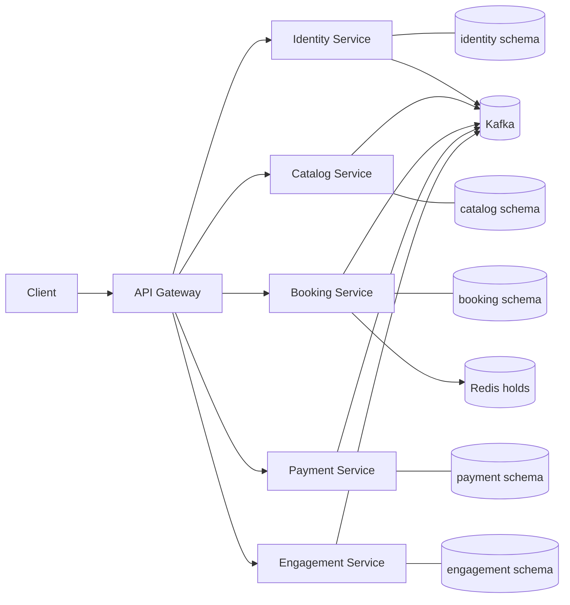

# Architecture

Services use local ACID transactions only. Transactional outbox rows publish versioned events, and inbox rows make consumers idempotent. Cross-service identifiers are opaque values; there are no cross-schema foreign keys or shared domain entities. PostgreSQL full-text projections are the initial search strategy, with an adapter boundary for OpenSearch later.

The primary asynchronous flow is payment capture to booking confirmation and ticket issuance, followed by an engagement notification. Sagas compensate failures such as payment capture without timely ticket issuance through retry, expiry, and refund actions.
